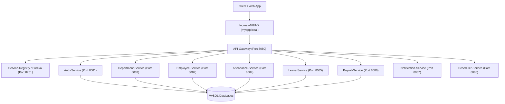
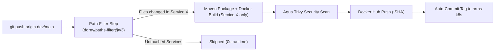

# 🏢 HRMS Microservices Platform

[](https://github.com/satheesh012/hrms-platform/actions)
[](https://spring.io/projects/spring-boot)
[](https://adoptium.net/)
[](https://www.docker.com/)
[](https://trivy.dev/)

An enterprise-grade, cloud-native **Human Resource Management System (HRMS)** built with Java 17, Spring Boot, Spring Cloud, and a modern **DevSecOps** delivery pipeline.

---

## 🏗️ Architecture Overview

The platform is designed as a distributed, polyglot-ready microservices architecture utilizing Netflix Eureka for service registry, Spring Cloud Gateway for centralized API routing, and dedicated microservices for distinct domain operations.



---

## 📦 Microservices Ecosystem

| Microservice | Port | Description | Database / Storage |
| :--- | :---: | :--- | :--- |
| **`Service-Registry`** | `8761` | Eureka Server for service discovery and heartbeat health registration. | In-Memory Registry |
| **`API-Gateway`** | `8080` | Spring Cloud Gateway for reverse proxying, authentication filtering, and routing. | Stateless |
| **`Auth-Service`** | `8081` | Authentication & authorization engine generating and validating JWT tokens. | MySQL (`authService`) |
| **`Department-Service`** | `8083` | Department hierarchies, managerial associations, and organizational units. | MySQL (`departmentService`) |
| **`Employee-Service`** | `8082` | Employee master profiles, roles, and historical records. Features Kubernetes HPA. | MySQL (`employeeService`) |
| **`Attendance-Service`**| `8084` | Clock-in/clock-out tracking, daily timesheet logs, and attendance summaries. | MySQL (`attendanceService`) |
| **`Leave-Service`** | `8085` | Leave requests, balance tracking, and managerial approval workflows. | MySQL (`leaveService`) |
| **`Payroll-Service`** | `8086` | Salary computations, deductions, tax calculations, and payslip generation. | MySQL (`payrollService`) |
| **`Notification-Service`**| `8087` | Asynchronous email and message notifications with Gmail SMTP integration. | Stateless |
| **`Scheduler-Service`** | `8088` | Automated cron triggers for scheduled reminders, payroll runs, and reports. | Stateless |

---

## 🔒 DevSecOps & Containerization

### 1. Multi-Stage Alpine Builds
All services leverage Docker multi-stage builds (`maven:3.9-eclipse-temurin-17-alpine` ➡️ `eclipse-temurin:17-jre-alpine`):
* **Slim Image Size:** Reduced final image footprint from ~800MB to ~220MB (a 72% reduction).
* **Minimal Attack Surface:** Builder tools, source code, and compilers are stripped from production runtime images.

### 2. Non-Root Security Context
Images execute under a dedicated non-root user:
```dockerfile
RUN addgroup -S spring && adduser -S spring -G spring -u 1000
USER spring:spring
```
This adheres to Kubernetes pod security standards (`runAsNonRoot: true`, `runAsUser: 1000`).

### 3. Vulnerability Scanning (Aqua Trivy)
Integrated directly into the CI pipeline to scan container images for OS and library CVEs (`CRITICAL,HIGH`) before pushing to Docker Hub.

---

## ⚡ Smart CI/CD Pipeline (GitHub Actions)

The Monorepo CI pipeline in [`.github/workflows/ci.yml`](.github/workflows/ci.yml) utilizes **Path Filtering** (`dorny/paths-filter@v3`):

* **Selective Compilation & Image Build:** Automatically evaluates `git diff` against the target branch ref. Only services whose directory or configuration changed will trigger Maven compilation, Docker packaging, Trivy scans, and registry pushes.
* **Drastic Build-Time Reduction:** Unchanged pushes finish in **~20 seconds**, saving hundreds of GitHub Actions runner minutes compared to full 10-service rebuilds (~5 minutes).
* **Automated GitOps Tag Propagation:** On successful build, the workflow updates the respective image tag inside the Kubernetes configuration repository (`hrms-k8s`) and commits automatically.



---

## 💻 Local Development

### Prerequisites
* JDK 17 (Eclipse Temurin recommended)
* Maven 3.9+
* Docker Desktop & Docker Compose (or Kubernetes)

### Build All Services
```bash
mvn clean package -DskipTests
```

### Build a Single Microservice
```bash
mvn -f Department-Service/pom.xml clean package -DskipTests
```

### Build Docker Image Manually
```bash
docker build -t satheesh012/department-service:latest -f Department-Service/Dockerfile .
```

---

## 🔗 Related Repositories

* **[hrms-k8s](https://github.com/satheesh012/hrms-k8s):** Kubernetes manifests, ArgoCD GitOps configuration, and Universal Helm Chart.
